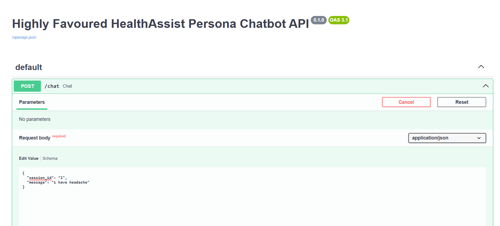

# HealthAssist — Multilingual Health Information Chatbot

HealthAssist is a multilingual, safety-focused health-information chatbot built using FastAPI, React, and Google Gemini Flash-Thinking.
It provides general wellness information while strictly avoiding diagnosis, prescriptions, or emergency medical advice.

## Features

Multilingual support (auto-detects user language)

AI-powered responses using Gemini 2.0 Flash

Safe health-information persona (non-diagnostic)

Clean and responsive chat UI

Conversation memory per session

FastAPI backend with CORS enabled

React frontend with message components

## Tech Stack
### Frontend

React (Vite / Next / CRA depending on your setup)

CSS for UI styling

Fetch API for backend communication

### Backend

FastAPI

Google Gemini API (google-generativeai)

Pydantic models

Session-based conversation memory

## image
